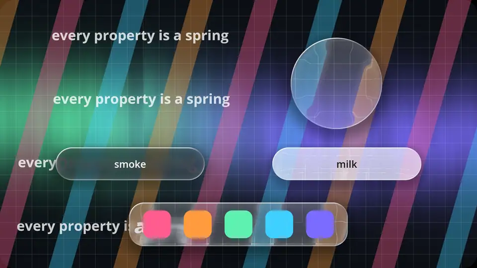
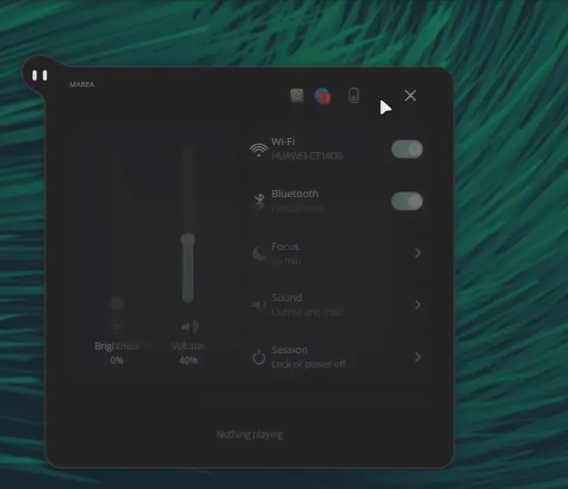

<div align = center>


<br>

[![Badge License]][License]
![Badge Language]
![Badge Commit]
[![Badge Issues]][Issues]
[![Badge Discord]][Discord]
[![Badge X]][X]
[![Badge Ko-fi]][Ko-fi]

<br>

pleamar is a language and a Rust runtime for your desktop shell: bars,
launchers, notification centres, docks, lock screens and widgets, written as **scenes** where every property is a spring and the animation never
waits for the logic.

<br>

---

**[<kbd> <br> Install <br> </kbd>][Install]**
**[<kbd> <br> Guide <br> </kbd>][Guide]**
**[<kbd> <br> Reference <br> </kbd>][Reference]**
**[<kbd> <br> pleamar-wm <br> </kbd>][pleamar-wm]**
**[<kbd> <br> Marea <br> </kbd>][Marea]**
**[<kbd> <br> Discord <br> </kbd>][Discord]**

---

<br>



<sub>`examples/glass.plm`, running: a clear lens, a plate that frosts itself where what is behind is busy, smoke and milk.</sub>

<br>
<br>

</div>

# Shell, window manager, companion: three pieces

**pleamar is a shell toolkit, like Quickshell.** You write your bar, widgets and
launchers with it, and they run **on the compositor you already use** —
Hyprland, Sway, niri, KDE… No need to change anything else.

The other two are separate, and optional:

- **[pleamar-wm]** is a Wayland compositor built on top of pleamar, where the
  window manager itself is a pleamar scene. Only if you want a whole desktop
  of it; you don't need it to use pleamar.
- **[Marea]** is my own shell, written in pleamar: a good example of how far a
  scene can go.

So if you are on Hyprland and just want a new bar, pleamar is all you need.

### Where it runs

| | |
| --- | --- |
| **Hyprland, Sway, niri, river, Wayfire, Labwc…** | ✅ Its home: bars, panels and shells anchor to the screen (layer-shell) |
| **KDE Plasma (Wayland)** | ✅ Bars and shells work; what is Hyprland's own —its workspaces— does not |
| **GNOME (Wayland)** | ⚠️ Only scenes in a normal window: GNOME has no layer-shell, so a bar cannot anchor. pleamar-wm can be picked as a session next to it |
| **pleamar-wm** | ✅ A whole desktop of its own |
| **X11 sessions** | ❌ pleamar is for Wayland |

# What's new

- **A logic that plays** (0.3.0): the logic can hear every frame and say where
  things are in that very frame, know which keys are held and where the mouse
  is, ask what touches what, make sound —a WAV, an Ogg, or a tone made on the
  spot— and read a game controller. With it, an image can be a sheet of
  pictures (`cell:`) or pixel art kept sharp (`pixels`). Small games on the
  desktop, in the same file as the bar.
- **Glass over the scene's own drawing** (0.3.0): a lens over a picture or a
  text of the scene's now bends that too, on any compositor.
- **Glass that behaves like glass** (0.2.35): the lens bends what is behind it as
  a pane would —a bevel, Snell's law, a colour for each index, a rim that
  mirrors—, and three new words say what kind of glass it is: `frost: auto`
  keeps it clear over something plain and frosts it where words or lines are
  behind, `smoke` darkens it for white text, `milk` whitens it for dark text.
- **Live pictures of your windows** (0.2.20, cheaper in 0.2.32):
  `thumbnails.live` gives a window's picture as a texture that follows it, for
  overviews and switchers that move.
- **Effects that cost less** (0.2.33): groups with opacity, blur or glow that do
  not reach each other are painted together —60 blurred groups went from 4.7 ms
  to 0.3 ms of recording a frame—, and a scene with one surface keeps far less
  memory (1.2 GB to 0.2 GB in the shell that reported it).

Every release, with what changed: [Releases].

# Features

- **Animation that never depends on logic**: the scene declares what moves and
  with which spring; a render thread walks it at the screen's pace. With the
  logic stalled for 600 ms, 38 frames still come out at 17 ms each.
- **A language of its own, checked on load**: a misspelled name is an error with
  file, line, arrow and «did you mean…?», never an `undefined` at runtime.
- **Every property is a spring** — interrupt it halfway and it turns without a jolt.
- **Shapes that melt into each other**: shadow, rim, light, gradients, glass
  that bends what is behind it (clear, frosted, smoked or milky), blur, glow,
  particles and your own WGSL shaders, all signed distance underneath.
  An svg comes in as paths, by layers, and melts with what carries it.
- **Luau logic in a sandbox**, on its own thread, behind permissions you approve —
  a plugin runs with what you allow it, never with everything you can do.
- **Enough for a small game**: a handler for every frame, held keys, the mouse,
  what touches what, sound, game controllers, sheets of pictures and pixel art.
- **System services with no code**: clock, audio, battery, network, media,
  notifications, tray, windows and their thumbnails, brightness, files — named
  in the scene and filled.
- **Lock screens** on `ext-session-lock`, where the compositor guarantees nothing
  else is seen while it lasts.
- **Live reload**: save the file and it reloads without losing what was in motion;
  save it broken and the last good scene stays, with a band saying where.
- **Its own compositor**: [pleamar-wm] runs other programs' windows inside a scene,
  so the window manager is one more file you can rewrite.
- **Your AI agent knows it**: the installer teaches Claude Code, Codex and
  OpenCode to build and verify pleamar scenes for you.
- **And it can use your desktop**: in [pleamar-wm] an agent gets a pointer
  and a keyboard of its own — it clicks and types in your browser while your
  mouse and keyboard stay yours, and you see it work. It speaks
  [Cua Driver](https://github.com/trycua/cua)'s protocol.
- **Light**: 81 MB and a first frame in 175 ms, against 336 MB and 1876 ms for
  the same bar in Quickshell.

<br>

<div align = center>

# Gallery

<br>



<sub>[Marea], a whole shell in one scene: here she changes her skin to liquid glass.</sub>

<br>
<br>

![Preview Desktop]

<sub>pleamar-wm with Marea: free windows, glass drop buttons, one scene each.</sub>

<br>
<br>

![Preview Effects]

<sub>`examples/effects.plm`: a WGSL aurora with glowing particles, a ripple that follows the pointer, a heat haze.</sub>

<br>
<br>

</div>

# Install

One line installs pleamar, the [pleamar-wm] window manager and [Marea] in your
home (nothing outside it), and keeps them up to date:

```sh
curl -fsSL https://raw.githubusercontent.com/k4ditano/pleamar/main/install.sh | sh
```

| | |
| --- | --- |
| `pleamar-update` | new changes, built and put in place (it says what is new) |
| `pleamar-update --session` | also pleamar-wm in the login screen (asks for sudo) |
| `pleamar-update --agent` | AI agents may use your windows in pleamar-wm, with a cursor of their own |
| `pleamar-update --remote` | this desktop from a browser elsewhere: a password and codes made, and `pleamar-wm remote` started with the session |
| `pleamar-update --uninstall` | the programs go; your `~/.config/pleamar` stays |

It tells you what your distribution is missing to build it (pacman, apt, dnf,
zypper) and offers to install it, builds in `~/.local/share/pleamar/src`, puts
`pleamar`, `pleamar-wm`, `pleamar-session`, `marea` and `pleamar-update` in
`~/.local/bin`, and makes your `~/.config/pleamar` the first time.

**Everything of yours lives in `~/.config/pleamar/`** — the folder for your
dotfiles: your shells (`shells/`), what starts with the desktop (`autostart`;
on Hyprland or any other compositor, `exec-once = pleamar --autostart`), and for
pleamar-wm its `session.conf`, `keys.conf` and your own `wm/session.plm`.

### Nix and NixOS

```sh
nix run github:k4ditano/pleamar -- --scene bar.plm
```

As a flake input (`pleamar.url = "github:k4ditano/pleamar"`): the package
(`pleamar.packages.${system}.default`, or `pkgs.pleamar` through
`pleamar.overlays.default`) and a home-manager module:

```nix
imports = [ inputs.pleamar.homeManagerModules.default ];
programs.pleamar = {
  enable = true;
  autostart = true;   # runs ~/.config/pleamar/autostart with your graphical session
};
```

The whole desktop (pleamar-wm with Marea, in your login screen) is
[pleamar-wm]'s NixOS module. With Nix on another distribution, graphical Nix
programs need [nixGL] to reach your GPU driver.

# With your AI agent

The installer writes pleamar's skill for every agent it finds — **Claude Code,
Codex, OpenCode** — and it refreshes itself on every update. Ask one *«make me a
bar with the time, the volume and my workspaces»* and it knows the language,
where the file goes, how to start it with your desktop, and how to check it
(it compiles it, opens it without a screen and looks at the picture) before
saying it is done. `pleamar --install-skill` does it by hand;
`pleamar --docs` prints the documentation of the version you have.

**And it can use the desktop.** A second skill, `pleamar-desktop`, teaches it
pleamar-wm's agent hands (`pleamar-update --agent`, or `agent on` in
`session.conf`): ask *«go to reddit and find my last post»* and it looks at the
window, clicks and types with a mint cursor of its own, on a seat apart from
yours — your mouse and keyboard stay free, the monitor it works on glows while
it does, and it stops to ask before publishing, sending or buying anything.

# A whole scene

```plm
language 0.1
scene Clock {
    surface { size: 240, 96; anchor: top; margin: 12 }
    permissions { services: "clock" }

    //  The time comes from the system: not a single line of logic here.
    service clock as now { time: text = "--:--"; date: text }

    prop hot = 0 ~quick

    body {
        color: #151616
        rim: 6%
        shadow: 0, 6, 18, 35%
        box { from: 0, 0; size: 240, 96; corner: 20 }
    }
    text now.time { at: 120, 44; anchor: center; size: 34; color: #f5f7f5 }
    text now.date { at: 120, 72; anchor: center; size: 12; color: #9ed6bd; opacity: 45% + hot * 55% }

    zone box whole { from: 0, 0; size: 240, 96; corner: 20 }
    on enter whole { hot: 1 }
    on leave whole { hot: 0 }
}
```

`pleamar --scene clock.plm`. Save the file and it reloads without losing
whatever was in motion; save it broken and the last good scene stays on screen,
with a band on top saying what does not compile and where. Rebuild pleamar itself and the
running one starts again with the same arguments.

# Getting started from the source

```sh
cargo build --release
./target/release/pleamar --scene examples/bar.plm       # a bar: workspaces, window, time and volume
./target/release/pleamar --scene examples/long-list.plm # five thousand rows in sixteen copies
./target/release/pleamar --scene examples/paths.plm     # paths, curves and gradients
./target/release/pleamar --scene examples/window.plm     # a normal window, with its frame
./target/release/pleamar --scene examples/icons.plm      # the system tray; right-click opens an icon's menu
./target/release/pleamar --scene examples/settings.plm     # saves what you pick in its own folder
./target/release/pleamar --scene examples/tide.plm       # a night sea that rises: a shader, glass, svgs by layers
./target/release/pleamar --scene examples/catch.plm      # a small game: frames, keys, a game controller, sound
./target/release/pleamar --check examples/bar.plm    # reads it, says whether it is fine, exits
./run-tests.sh                                               # the language tests, and the examples in its reference
```

Options used daily: `--screen A,B` (which monitors), `--say` (talk to it from
outside, or from a compositor shortcut), `--mouse "360,90@500 click@3200"` (a
pretend mouse, to rehearse without touching the real one), `--stall MS` (stall
the logic on purpose and watch the screen carry on).

If something stutters on your machine, `pleamar --report` measures every scene
running for 30 seconds while you use the desktop, and writes down what it saw
—frame times, where the late frames went, the card, the CPU's clock and
temperature, what else took the CPU— in `~/pleamar-report-….md`, with no personal
data. Send it to us in an issue.

# The quick comparison

The same bar, written twice: in Quickshell (`proyecto-marea`, 370 QML files) and
in pleamar (`marea-plm`, one `.plm` and one `.luau`). Both running at once, both
freshly started, same 60 Hz monitor, on an RTX 2060.

| | Quickshell | pleamar |
| --- | --- | --- |
| real memory (PSS) | 336 MB | **81 MB** |
| time to first frame | 1876 ms | **175 ms** |
| frames per second while animating | ~24 | **60** |
| CPU per painted frame | 0.257 % | **0.083 %** |
| CPU with nothing moving | never drops | **0.3 %** |
| opening a panel | 6.2 % → 12.3 %, and 9.5 % after closing it | 4.4 % → 4.9 %, and back to 4.5 % |

On raw CPU, with both animating, the difference is 20 %: **4.96 % against
6.17 %**. That is what it is, and it should be said before the pretty numbers.
What changes the picture is that pleamar is painting **two and a half times more
frames** while spending less, and that when nothing moves it **sleeps**.

The numbers, how they were taken and what to watch out for: `marea-plm/MEDIDAS.md`.

# The language in five minutes

A `.plm` file is a scene: what is seen, and how it reacts.

| | |
| --- | --- |
| `surface { size: full, 44; anchor: top }` | the window it asks for. Several per scene, and `kind: window` for a normal one |
| `fact open = false` · `text title = "…"` | what the logic may report. Typed too: `fact mode: low \| normal \| critical` |
| `prop x = 360 ~calm` | something that moves. Every property is a spring |
| `service audio { volume: number; muted: bool }` | a system service, by name, with no logic |
| `model rows max 14 { label: text }` · `for r in rows { … }` | a list the logic fills |
| `box`, `ellipse`, `arc`, `line`, `path`, `text`, `image`, `input` | what gets drawn |
| `figure hat = file "hat.svg"` | an svg **as geometry**: its layers are paths, so they melt, tint and turn |
| `body { color/gradient/rim/light/shadow }` | several shapes melted into one silhouette |
| `row` / `column` | layout, with gap, padding, alignment, `view:` to scroll and `wrap:` for a grid |
| `component Row(r: record) { … }` | something to copy, with typed parameters and named slots |
| `on press hit { open = true }` · `every 2s { … }` | rules, run by the renderer |
| `follow`, `blink`, `wave`, `spin`, `look` | movement that carries itself |
| `layer`, `gesture`, `posture` | who wins a slot, and timelines |
| `permissions { run: "date"; services: "audio" }` | undeclared, the logic cannot |

The full reference, with its grammar and its checked examples, is in
[`docs/11-language-reference.md`](docs/11-language-reference.md). To
start from zero, [`docs/guide.md`](docs/guide.md); to copy and paste,
[`docs/recipes.md`](docs/recipes.md).

# The logic

If there is a `bar.luau` next to `bar.plm`, that is its logic: Luau in a
sandbox, on its own thread, which the renderer never waits for. It can only cross
the boundary the scene declares — `fact.open = true`, `text.title = …`,
`model.rows = {…}`, `emit`, and listening with `on(…)` — plus timers, `sys` for
services and `run` for system commands, all behind permissions. Reference in
[`docs/10-luau-logic.md`](docs/10-luau-logic.md).

A library with its own `.luau` next to it is a **plugin**: its boundary lives
under its name (`Clock.now`), it runs on its own thread, and its permissions are
approved by whoever uses it, with `pleamar --approve`. Unapproved, it runs
touching nothing.

# In the editor

`pleamar --lsp` is a language server over stdio, with this same compiler behind
it: mistakes as you type, which words fit here, what the word under the cursor
means, go to where a name was declared, where it is used, and renaming it.
`pleamar --highlight vim|vscode` writes the syntax file straight from the
vocabulary, so it cannot fall behind. Both, already generated, in
[`editor/`](editor/).

# How it is built

Three threads that never wait for each other: **platform** (windows and input),
**logic** (Luau) and **render** (owner of the springs and the clock). Plus one
per plugin, one per service, and a workshop thread for text and images.

| | |
| --- | --- |
| `language/` | From text to scene: `tokens` tokenises, `tree` groups without knowing what anything means, `compiler` gives it meaning and checks the names, `vocabulary` is the list of what exists |
| `scene.rs` | The contract: properties, expressions, drawing instructions, rules, layers, gestures, zones, surfaces |
| `render.rs` | The interpreter. Still, it does not paint a single frame |
| `gpu.rs` · `shape.wgsl` | One quad per element; each pixel only runs the shapes of the element covering it |
| `shapes.rs` | The geometry, written once, used three times: the GPU, the mouse and the bounding boxes |
| `logic_luau.rs` | A scene's logic: Luau in a sandbox, with the boundary and nothing else |
| `text.rs` | Real text (`cosmic-text`) and images (SVG, PNG, JPEG) in an atlas at the monitor's scale |
| `platform/` | The only part that knows about the system: Wayland, the services, files, the clock |
| `lsp.rs` | The language server and the highlighters, both drawn from the vocabulary |

# What is missing

Measured against two real Quickshell configs (648 QML files between them), in
[`docs/07-whats-missing.md`](docs/07-whats-missing.md): a live view of a whole
screen inside the scene (windows come as thumbnails), input methods for Japanese
or Chinese, and list copies that are born and die on their own.

Known limitations, **each one with its plan to fix it**, in
[`docs/08-limitations.md`](docs/08-limitations.md). They are written down as
they show up, not at the end.

# Documentation

| | |
| --- | --- |
| [`docs/guide.md`][Guide] | From zero to a bar, step by step |
| [`docs/recipes.md`](docs/recipes.md) | Patterns that already work, ready to copy |
| [`docs/11-language-reference.md`][Reference] | The reference: grammar, types, every element and every property |
| [`docs/10-luau-logic.md`](docs/10-luau-logic.md) | What the logic can do, and what it cannot |
| [`docs/07-whats-missing.md`](docs/07-whats-missing.md) | Parity with Quickshell, told by real usage |
| [`docs/08-limitations.md`](docs/08-limitations.md) | Everything that fails or is missing, with its plan |
| [`docs/02-how-it-works.md`](docs/02-how-it-works.md) | Inside: the threads, the renderer, the why |
| [`skill/`](skill/) | The skill the installer gives your AI agents |

The working notes (01, 03–06, 09) are the design logbook: how this got here.

# Special Thanks

<br>

**[wgpu]** - *For every pixel*

**[Luau]** - *For logic that can be sandboxed*

**[cosmic-text]** - *For real text*

**[resvg]** - *For reading svg*

**[Smithay]** - *For the compositor's protocol side*

**[Quickshell]** - *For showing what a desktop written in a language can be*

**[Hyprland]** - *For showing how good a desktop can feel*

# License

pleamar is under the [BSD 3-Clause License][License], like Hyprland: use it,
change it, ship it, sell it — keep the copyright notice. Every dependency is
permissive (MIT, Apache-2.0, BSD-3-Clause, Zlib); `THIRD-PARTY.md` lists them,
and their notices travel with any binary you hand out.

Contributions are welcome, made with AI or without it: see the [AI policy](AI_POLICY.md).

Made by **[@k4ditano][X]** — follow along on X for what comes next, and come
and say hi, ask or show what you made on **[Discord]**.
If it makes your desktop nicer, you can **[buy me a coffee on Ko-fi][Ko-fi]** ☕

<!----------------------------------------------------------------------------->

[Install]: #install
[Guide]: docs/guide.md
[Reference]: docs/11-language-reference.md
[pleamar-wm]: https://github.com/k4ditano/pleamar-wm
[Marea]: https://github.com/k4ditano/marea-plm
[License]: LICENSE
[X]: https://x.com/k4ditano
[Discord]: https://discord.gg/N7kbYC49b2
[Ko-fi]: https://ko-fi.com/k4ditano
[Issues]: https://github.com/k4ditano/pleamar/issues
[Releases]: https://github.com/k4ditano/pleamar/releases
[nixGL]: https://github.com/nix-community/nixGL

<!----------------------------------{ Thanks }--------------------------------->

[wgpu]: https://github.com/gfx-rs/wgpu
[Luau]: https://luau.org
[cosmic-text]: https://github.com/pop-os/cosmic-text
[resvg]: https://github.com/linebender/resvg
[Smithay]: https://github.com/Smithay/smithay
[Quickshell]: https://quickshell.outfoxxed.me
[Hyprland]: https://github.com/hyprwm/Hyprland

<!----------------------------------{ Images }--------------------------------->

[Preview Desktop]: assets/desktop.png
[Preview Effects]: assets/effects.png

<!----------------------------------{ Badges }--------------------------------->

[Badge License]: https://img.shields.io/badge/license-BSD--3--Clause-9ed6bd?style=flat-square
[Badge Language]: https://img.shields.io/badge/made%20with-Rust%20%2B%20Luau-2c7684?style=flat-square
[Badge Commit]: https://img.shields.io/github/last-commit/k4ditano/pleamar?style=flat-square&color=9ed6bd
[Badge Issues]: https://img.shields.io/github/issues/k4ditano/pleamar?style=flat-square&color=2c7684
[Badge Discord]: https://img.shields.io/badge/chat-Discord-5865f2?style=flat-square&logo=discord&logoColor=white
[Badge X]: https://img.shields.io/badge/follow-@k4ditano-000000?style=flat-square&logo=x
[Badge Ko-fi]: https://img.shields.io/badge/support-Ko--fi-ff5e5b?style=flat-square&logo=ko-fi&logoColor=white
